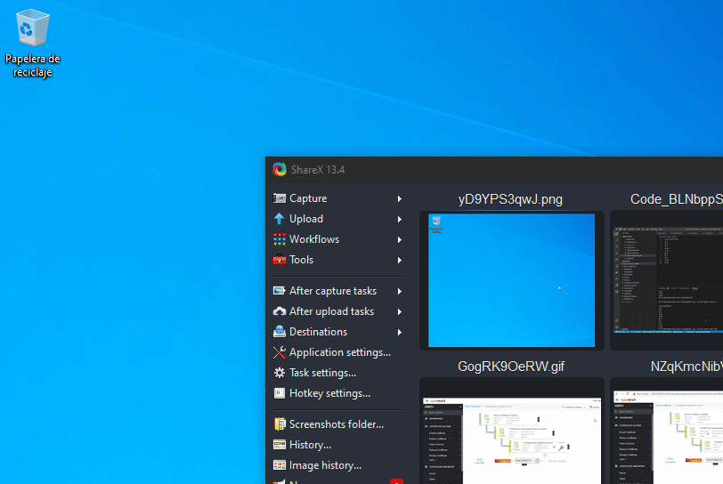
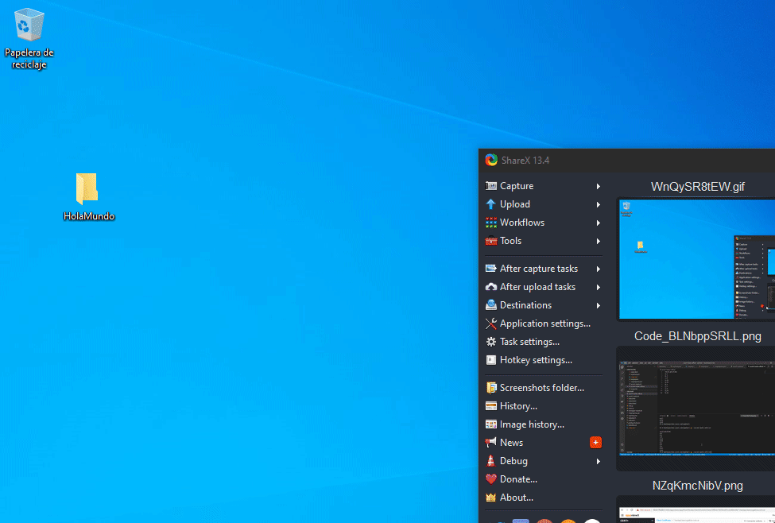
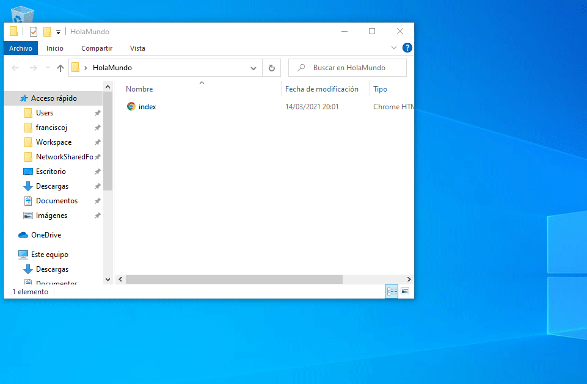
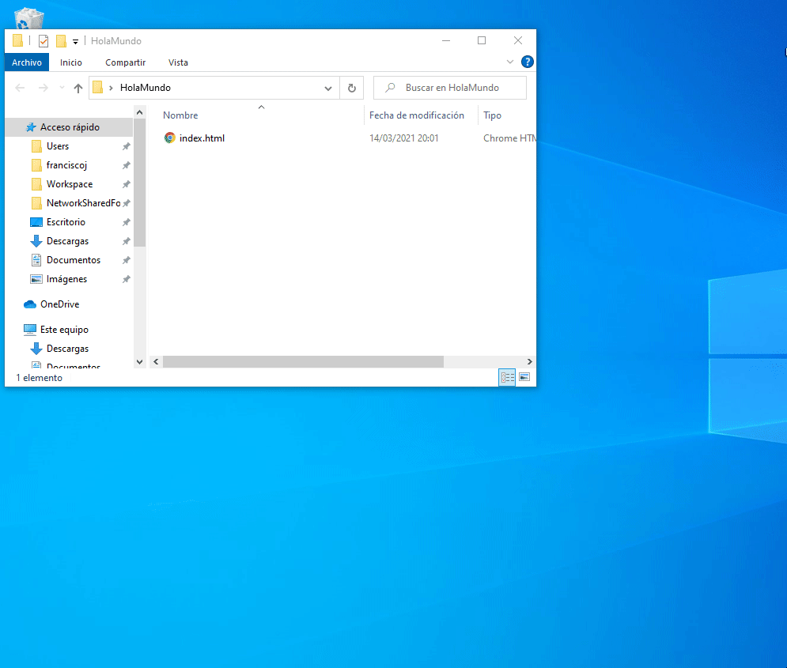
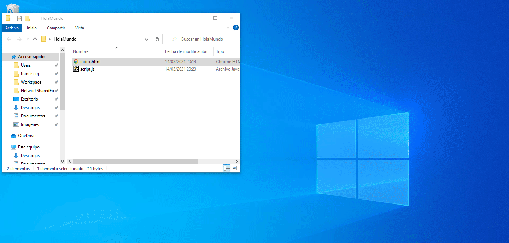

# Hola Mundo en JavaScript

Algo que tienen en común todos los lenguajes de programación es que siempre tiene un primer ejemplo de cómo utilizarlo llamado "Hola Mundo" ("Hello World" en inglés).

A continuación vamos a ver el "Hola Mundo" en **JavaScript** desde el navegador web (browser) de Google, **Google Chrome**.

Primero creamos un directorio (también se le dice "carpeta") en nuestro escritorio. Le vamos a poner de nombre "HolaMundo", todo junto, aveces tener espacios en blanco en los nombres de los archivos y directorios suelen dar problemas, es preferible no utilizarlos en la medida que se pueda.



Abrimos el directorio y creamos dentro un archivo llamado "index.html".



> NOTA: Para poder trabajar cómodos, es necesario poder modificar la extensión de los archivos, para esto conviene siempre tener habilita la opción "Extensiones de nombre de archivo". La misma se encuentra dentro del menú "Vista" > "Mostrar u ocultar" > "Extensiones de nombre de archivo".
> 

Dentro del archivo "index.html" ingresar el siguiente código.

```HTML
<!DOCTYPE html>
<html lang="">
  <head>
    <meta charset="utf-8">
    <title>Hola Mundo!!</title>
    <script type="text/javascript" src="script.js"></script>
  </head>
  <body>
    
  </body>
</html>
```

Este arhcivo HTML lo único que hace es llamar a un archivo "script.js" donde tendremos nuestro código JavaScript. A continuación debemos crear el archivo "script.js".

> 

Una vez hecho todo esto solo nos falta agregar nuestro código de programación JavaScript dentro de nuestro archivo "script.js".

```JavaScript
document.write("Hola Mundo!");
```



---

## Git

Git es una herramienta que pertenece al tipo de "Sistemas de Control de Versiones". Debido a esto nos permite hacer dos cosas principalmente:

- Guardar de forma "versionada" nuestro código de programación.
- Compartir un mismo código de programación entre varias personas.

Los comandos más importantes y comunes que vamos a ver con Git son:

- *git init:* Para iniciar un repositorio.
- *git add:* Para agregar archivos a sistema de versionado de Git.
- *git commit -m:* Para dejar marcado 1ue los archivos agregados hasta ese punto deseamos "versionarlos" de la manera en la que se encuentran en ese momento.
- *git fetch --all*: En el caso de que estemos trabajando con otras personas es probable que alguien ya haya estado actualizando el repositorio, con este comando podemos verificar si tenemos nuestro repositorio local actualizado.
- *git pull:* Con este comando podemos actualizar nuestro repositorio local en el caso de que nuestro repositorio local no tenga las ultimas actualizaciones que tenga el repositorio principal.
- *git push:* Por último con este comando enviamos nuestro código actualizado al repositorio central.

## Instalar Git


## Crear cuenta en GitHub

Ingresar a la URL de [GithHub](https://github.com/ "github.com")


### Enlaces

[https://github.com/join/get-started]

[https://github.com/join/customize]


## Crear primer proyecto en GitHub

## Markdown

Es un lenguaje de marcado (Markup language) desarrollado por "John Gruber y Aaron Swartz" en el 2004.

Acontinuación vas a ver un par de ejemplos en comparación con otro lenguaje de marcado como HTML para tener en cuenta:

Elemento | HTML | Markdown
---|---|---
Título | \<h1\>Título\<\/h1\> | \# Título
Subtítulo | \<h2\>Subtítulo\<\/h2\> | \#\# Subtítulo
Lista | \<ul\><br />\<li\> Opción1 \<\/li\><br />\<li\> Opción2 \<\/li\><br />\<li\> Opción3 \<\/li\><br />\<\/ul\> | \- Opción1 <br />\- Opción2 <br />\- Opción3 


- [Markdown Cheatsheet](https://github.com/adam-p/markdown-here/wiki/Markdown-Cheatsheet "Markdown Cheatsheet") por Adam Pritchard

- [Wikipedia Markdown](https://en.wikipedia.org/wiki/Markdown "Wikipedia Markdown")